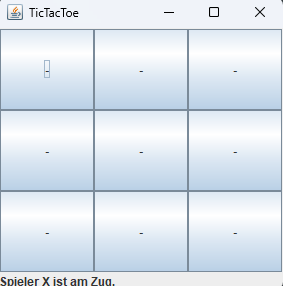
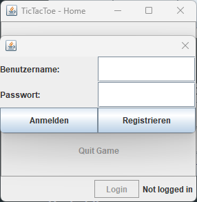
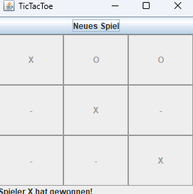

# Java TicTacToe Project
This repository contains the source code of the IT project TicTacToe in the Java programming language. The project emerged from the 11th grade computer science advanced course (Abi 2024) and was developed by @JH220.

## Build
To build this project, it's best to use an IDE like IntelliJ IDEA. The project was developed with IntelliJ IDEA 2020.3.3 (Ultimate Edition) and Java 15.0.2. The project uses the JavaFX library, which is included in the JDK. To build the project, you need to add the JavaFX library to the project. To do this, go to `File > Project Structure > Libraries > + > Java > <path to JavaFX lib folder>`.

Currently, the jdbc driver is only included as a jar file. To use the database, you need to add the driver to the project. To do this, go to `File > Project Structure > Libraries > + > Java > <path to jdbc driver jar file>`. After that, you can build the project.

## GUI

### Preview

### Login Screen

### Restart Screen
