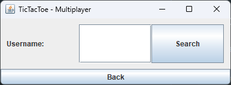

# Java TicTacToe Project
This repository contains the source code of the IT project TicTacToe in the Java programming language. The project emerged from the 11th grade computer science advanced course (Abi 2024) and was developed by @JH220.

## Info
For each multiplayer win 3 points are added to the players account.<br>
For each multiplayer loss only 1 point is added to the players account.<br>
For each multiplayer tie 2 points are added to the players account.

## Build
To build this project, it's best to use an IDE like IntelliJ IDEA. The project was developed with IntelliJ IDEA Ultimate Edition and Java 17.

## GUI





## Protocol
### General
```
-> connected
register:<user>:<pass> -> register:success
register:<user>:<pass> -> register:failed
login:<user>:<pass> -> login:success:<user>:<user>
login:<user>:<pass> -> login:failed
logout:<user>:<user> -> logout:success
logout:<user>:<user> -> logout:failed
points:<user>:<user> -> points:<amount>
points:<user>:<user> -> points:failed
```

### Logged In
```
challenge:<challenger>:<user>:<user> -> challenge:accepted
challenge:<challenger>:<user>:<user> -> challenge:denied
challenge:<challenger>:<user>:<user> -> challenge:error:timeout
challenge:<challenger>:<user>:<user> -> challenge:error:ratelimited
challenge:<challenger>:<user>:<user> -> challenge:error:offline
challenge:<challenger>:<user>:<user> -> challenge:error:failed
```

### In Game
```
move:<user>:<token>:<row>:<col> -> move:success:<row>:<col>
move:<user>:<token>:<row>:<col> -> move:failed
```

### Client Events
```
request:<challenger> -> accept/deny:<user>:<token>:<challenger>
request:<challenger> -> accept/deny:failed
game:move:<row>:<col>
game:won
game:lose
game:tie
```